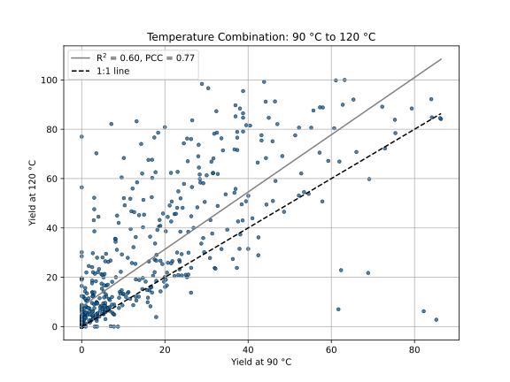
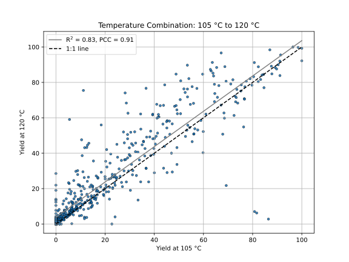
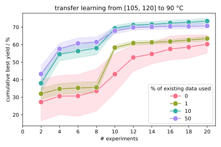

# Multi Context BO

## Intro

## Investigation

## Results

### Direct Arylation – Transfer Learning

Correlation of [Direct Arylation](https://www.nature.com/articles/s41586-021-03213-y) reaction yields with reaction parameters differing only in temperature.
All three possible combinations for the temperatures 90, 105, and 120 °C were investigated.

A modest correlation with the Pearson correlation coefficient amounting to ca. 0.8-0.9 indicates that transferring knowledge about parameter combinations at a given temperature to other temperatures is reasonable.

Bayesian optimization of reaction parameters to maximize the yield for the [Direct Arylation](https://www.nature.com/articles/s41586-021-03213-y) data set.
The reaction parameters are optimized with a fixed temperature of 90 °C, utilizing different amounts of initial data for 105 and 120 °C.

The data suggests that initial data from correlated measurements added on the order of ~ 10 % significantly enhances the Bayesian optimization prediction. 
Distinctly larger portions of initial data (assuming only a finite correlation) do not necessarily improve the Bayesian optimization any further.
In contrast, taking only 1 % of the existing data into account provides not as much information and thus leads only to a smaller improvement.

## Summary

