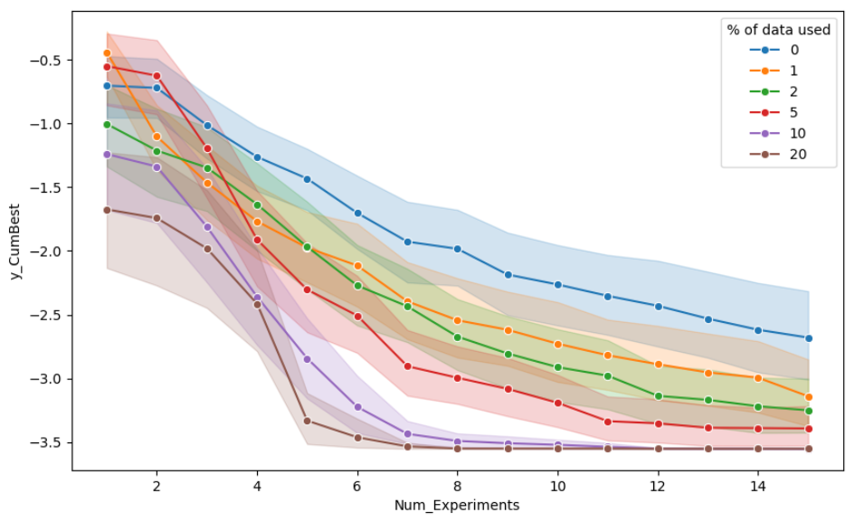
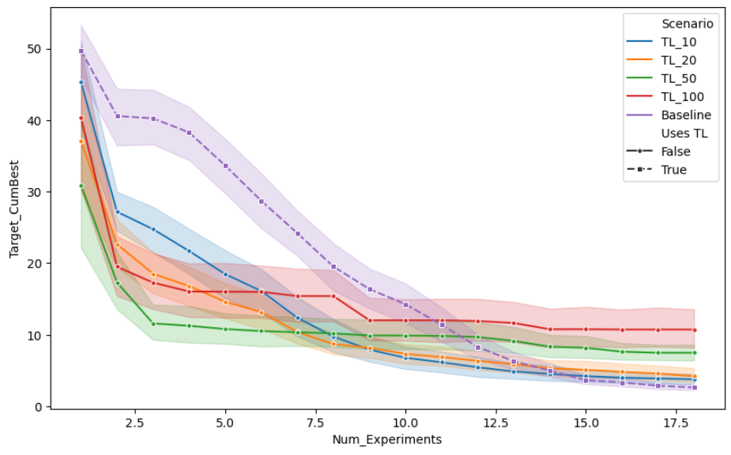
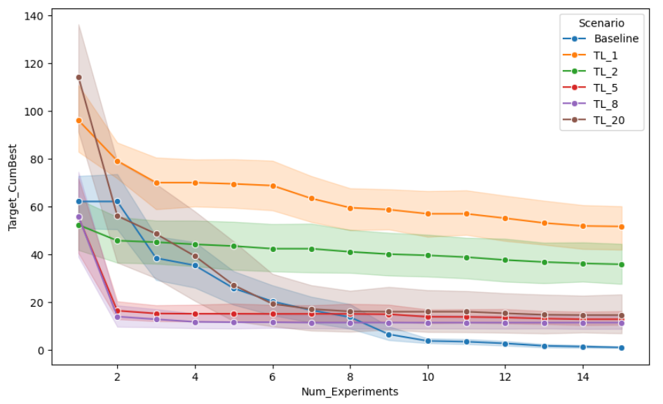
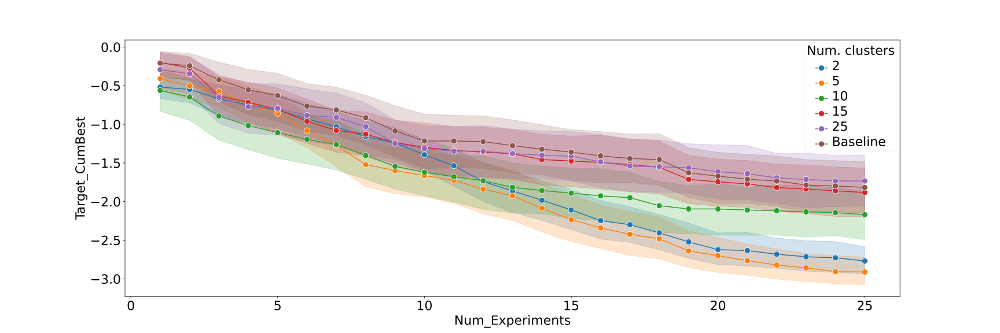
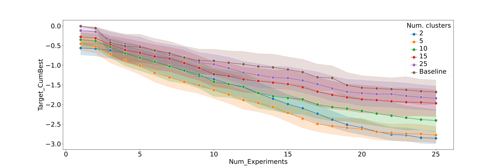
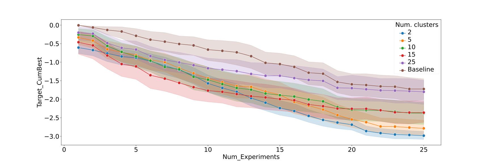

# Project 26: Multiple-Context Bayesian Optimization

## Intro
Traditionally, Bayesian optimization (BO) is performed on a single, isolated campaign,
which is not aware of results of potentially similar pre-existing campaigns. Examples
for such related campaigns could be:
- Optimizing the same reaction conditions, but for a different pair of educts (assuming
  the same reaction type)
- Optimizing mixtures for cell culture media, but for a different cell type
- Performing the exactly same optimization to calibrate a complicated piece of
  equipment, but in another geophysical location

In all of these examples we want to perform a new campaign which is similar to one or
more already performed campaigns. It is often not clear *how* similar or even along which
(potentially previously hidden) parameters, so including these data along a set of newly
added traditional parameters can be difficult. The data should also not be added as part
of the same campaign, as it might happen that the other campaign results are only
slightly or even anti-correlated.

In this project we aim to investigate the performance of BO in such multi-context situations.
As the transfer of knowledge from pre-existing campaigns, we refer to this situation also
as *Transfer Learning* in the context of BO.
For this, we create a range of analytical test cases and one simulation based on real
world data. In our framework, each test comprises a target task
(the actual campaign ot be optimized) and one or more source tasks
(the related campaigns). The technical implementation is done via utilizing
[BayBE](https://emdgroup.github.io/baybe/)'s `TaskParameter` which itself utilizes
[BoTorch](https://botorch.org/)'s index kernel as part of an otherwise common Gaussian
Process surrogate model. Various other aspects uch as parameter encoding is done by
BayBE's internal logic.

## Results

### Direct Arylation
The [Direct Arylation](https://www.nature.com/articles/s41586-021-03213-y) is an
excellent real-world candidate for testing transfer learning. The temperature parameter
had 3 discrete values. It is thus possible to separate out 3 sub-data sets that measured
reaction yields as a given fixed temperature. While the results for a given combination
of the remaining parameters is expected to be temperature dependent, the overall trends
should be similar. This opens up the avenue to take results from other temperatures to
perform a new optimization campaign at a different temperature. This situation was
mimicked in this study.

First, we assessed the correlation of reaction yields with reaction parameters differing
only in temperature for all three possible combinations of temperatures 90, 105, and
120 °C. A modest to strong correlation with R2 coefficients in the range 0.6-0.8
indicates that transferring knowledge about parameter combinations at a given
temperature to other temperatures is reasonable, and we would expect a boost in
optimization performance.

Bayesian optimization of reaction parameters to maximize the yield was performed via
backtesting. The reaction parameters are optimized with a fixed temperature of 90 °C,
utilizing different amounts of initial data for 105 and 120 °C.

The result suggests that initial data from correlated measurements added on the order
of ~ 10 % significantly enhances the Bayesian optimization prediction. Distinctly larger
portions of initial data do not necessarily improve the optimization any
further. In contrast, taking only 1 % of the existing data into account provides not as
much information and thus leads only to a smaller improvement.

### Negated Noisy Hartmann 3D
We optimize the Hartmann-3D function, a common benchmark for BO, taking its negated
noisy variant as source task. For this investigation the otherwise analytical functions
were evaluated on a grid, and we optimize the resulting discrete search space. This
choice is motivated by utilizing a source task that is anti-correlated tos ee whether
this relationship is automatically figured out and utilized for optimization
improvement.

The result shows a clear benefit from adding source task data, even though it was noisy
and anti-correlated to the target task. We see a remarkable improvement, already after
adding only 1% of the existing source task data. In particular, the early optimization
phase is boosted and the minimum is approached in a much steeper fashion. This outcome
shows the enormous potential of this technology to boost real-world optimization
campaigns in regimes where data on similar campaigns is available.

### Truncated Square
Here, we take a 3 dimensional square function as target task with a minimum at 0 to be
found. For the source task, we use a noisy and truncated version of it, where the
truncated part is the center right around the minimum. This example is inspired by test
cases for multi-fidelity optimization and tests the case where the two campaigns are
strongly correlated, except for a very specific region where the source campaign
provides no information at all. After construction, the source
and target tasks evaluated on a sample of 1000 points had an overall R2 of about 0.77.

We see once more that the transfer learning benefits the optimization. Just
10 or 20 data points samples from the analytical source task provide a tremendous boost
in the early optimization phase.

However, we also observe that too many source points has a negative
impact. For instance, taking 50 source points shows the best initial performance,
but starts to slow the convergence at alter stages. For 100 source points we start to
see also a reversal in performance in early stages, while convergence is further
hindered.

### Negated Noisy Levy

This test function exhibits a strongly rippled surface. We take the negated noisy
version as source and evaluate both functions on a grid before performing optimization
in the resulting discrete search space.

Contrary to the other test cases, the result here do not look as promising. A transfer
of 1% or 2% of source points is strongly slowing the optimization down. For larger
amounts of transferred data, e.g. 8 and 20% we get a boost in the initial optimization
phase, but also a worsened convergence later on. The nature of this result needs to be
investigated further, in particular the role of discretization could impact the results
for such a highly fluctuating test function.

### Reducing Source Data via Clustering

Since the results from above indicate that there is a level of including too many
source points which reduce the optimization performance, we perform tests on
sub-selecting points from the source data instead of feeding the target campaign with
all source data.

This exercise was done with a scaled, shifted version of the Hartmann 6D function as
source campaign while the target campaign is the original function. We investigate
sets of randomly sampled source data set sizes, which in return are clustered via
KMedoids. The cluster centroids are taken as parts of the source data that is ingested
by the target campaign before optimization starts.

#### 30 Available Source Points

#### 50 Available Source Points

#### 100 Available Source Points

We find that the baseline of ingesting all available source points always performs
worst, independently of the amount of source points. This is roughly consistent with
the results of the other studies in this project. Surprisingly, the best performers are
often the campaigns with a small amount of clusters (2 or 5) resulting in also only a
small number of ingested source points. Further investigation is needed to confirm this
trend on other test problems. The even coverage achieved by the clustering seems to be
more important than the sheer amount of source points available.

## Summary

The overall trends revealed in this study show:
- It is almost always beneficial to add source data of related tasks to the target
  optimization campaign
- The optimization boost can also be expected with multiple, anti-correlated, noisy or
  partially correlated source campaigns which instills hope for the robustness of this
  technology
- There seems to be a transition after which adding more source points does not
 increase performance further or even reduces it
- Preliminary results of sub-sampling larger source data sets seem to indicate that it
  is better to provide small sets of source data that cover the search space more evenly
  rather than providing large sets of source data. Our interpretation of this is that
  it might be more beneficial for a target campaign to receive a small amount of
  information about the larger trends instead of receiving lots of data causing details
  to be fitted by the surrogate model. Because source and target tasks are never
  perfectly correlated, the latter could be detrimental to optimization of the target
  campaign.

## Authors

- Marcel Mueller (Merck KGaA / EMD group and University of Bonn)
- Joscha Hoche (Merck KGaA / EMD group)
- Viola Muning Li (Merck KGaA / EMD group)
- Tobias Plötz (Merck KGaA / EMD group)
- Rim Rihana (Merck KGaA / EMD group)
- Alexander Hopp (Merck KGaA / EMD group)
- Martin Fitzner (Merck KGaA / EMD group)